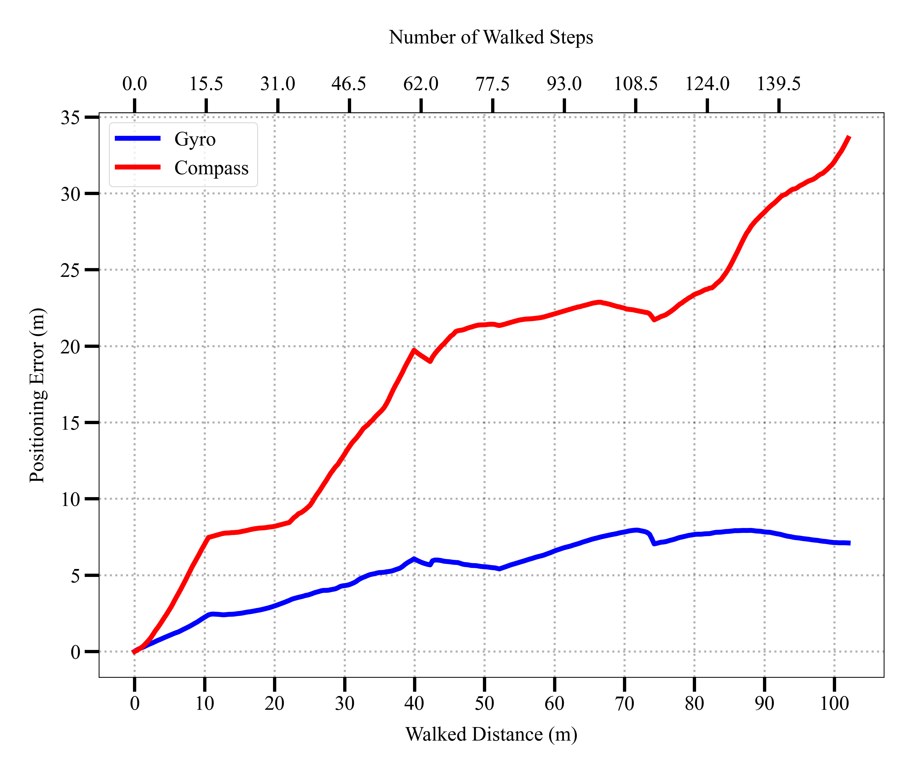
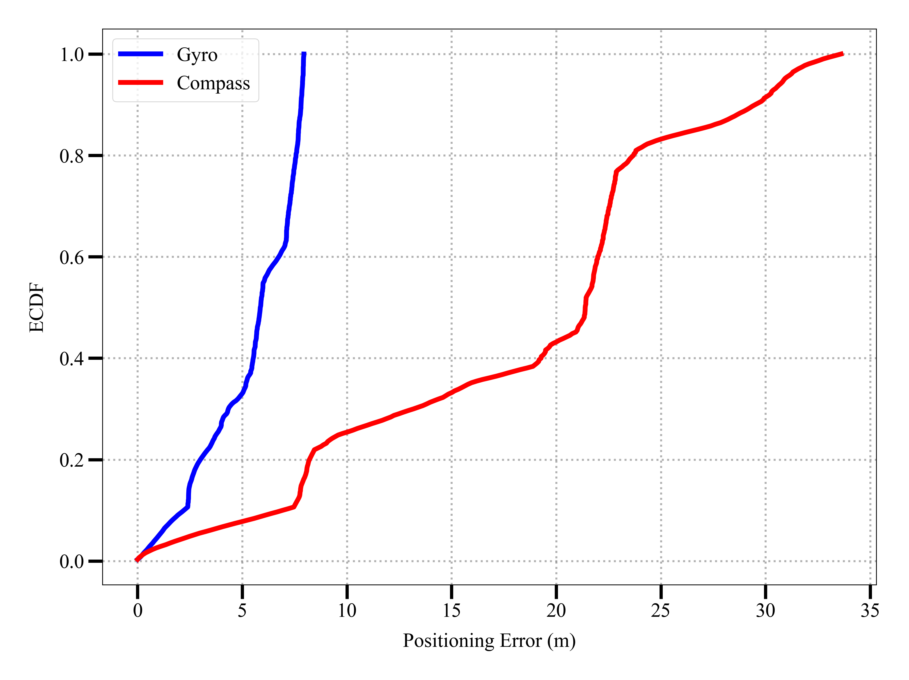

# Positioning Error Analysis Summary

## Key Findings

| Method   | Average Error | Min Error | Max Error | Standard Deviation |
|----------|---------------|-----------|-----------|-------------------|
| 📱 Gyro  | 5.45 m        | 0.00 m    | 7.94 m    | 2.23 m           |
| 🧭 Compass| 18.27 m       | 0.00 m    | 33.61 m   | 8.49 m           |

## 📊 Visual Analysis

Three visualizations were created to analyze the positioning errors:

### 1. Distance Error Plot

This plot shows how positioning errors change as the user walks further. Key observations:
- Gyro errors (blue) are consistently lower than Compass errors (red)
- Compass errors increase more rapidly with distance
- Gyro errors stabilize around 6-7 meters even at longer distances

### 2. Error Distribution (ECDF Plot)

The Empirical Cumulative Distribution Function (ECDF) shows:
- Gyro errors are more tightly distributed in the lower range
- About 80% of Gyro errors are below 7.4 meters
- Compass errors have a much wider distribution
- Most Compass errors are above 9.8 meters

### 3. Error Range Comparison (Box Plot)

The box plot clearly demonstrates:
- Gyro has a much narrower error range
- Compass errors are not only higher but more variable
- The median (middle line) of Gyro errors (~5.9m) is much lower than Compass (~21.4m)

## 💡 Conclusion

**Gyroscope-based positioning significantly outperforms compass-based positioning:**
- Gyro errors are 70% lower on average
- Gyro errors show less variability and more consistency
- Gyro positioning maintains better accuracy over longer distances

This analysis confirms that gyroscope-based positioning is the more reliable method for indoor positioning in this scenario, particularly when walking longer distances. 