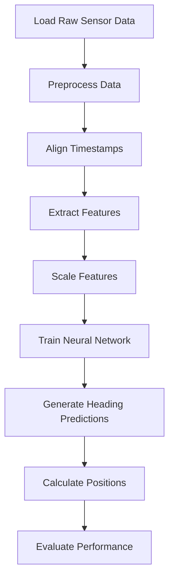

# Technical Implementation Details: Neural Network Fusion

## Data Processing Pipeline

The fusion model implementation follows these key steps:



## 1. Data Collection and Preprocessing

### Input Data
- **File path**: `/Users/shaoxinyi/Downloads/FYP2/Data_collected/1536_CompassGyroSumHeadingData.txt`
- **Format**: CSV with semicolon delimiter
- **Data types**: Gyro and Compass readings with timestamps

### Feature Extraction
The model uses the following features:

**Gyroscope features**:
```python
gyro_input_cols = ['axisZAngle', 'gyroSumFromstart0', 'compass']
```

**Compass features**:
```python
compass_input_cols = ['Magnetic_Field_Magnitude', 'gyroSumFromstart0', 'compass']
```

### Timestamp Alignment
A critical step is aligning gyroscope and compass readings by timestamp:

```python
# Create a DataFrame for each timestamp
timestamp_df = pd.DataFrame({
    'timestamp': np.sort(np.unique(np.concatenate([gyro_timestamps, compass_timestamps])))
})

# For each timestamp, find the closest gyro and compass readings
timestamp_df['gyro_idx'] = timestamp_df['timestamp'].apply(
    lambda x: np.argmin(np.abs(gyro_timestamps - x)) if len(gyro_timestamps) > 0 else -1
)
timestamp_df['compass_idx'] = timestamp_df['timestamp'].apply(
    lambda x: np.argmin(np.abs(compass_timestamps - x)) if len(compass_timestamps) > 0 else -1
)
```

### Data Normalization
Features are normalized using Min-Max scaling:

```python
scaler_X = MinMaxScaler()
scaler_y = MinMaxScaler()

X_scaled = scaler_X.fit_transform(X)
y_scaled = scaler_y.fit_transform(y)
```

## 2. Neural Network Architecture

The model uses a simple yet effective feed-forward neural network:

```python
model = Sequential([
    Dense(128, activation='relu', input_shape=(X_train.shape[1],)),
    Dropout(0.3),
    Dense(64, activation='relu'),
    Dropout(0.3),
    Dense(32, activation='relu'),
    Dense(1)
])
```

### Model Details:
- **Total parameters**: ~10K parameters
- **Input dimension**: 6 (3 gyro + 3 compass features)
- **Output dimension**: 1 (Heading prediction in degrees)
- **Activation functions**: ReLU for hidden layers, Linear for output layer
- **Regularization**: Dropout layers (30%) to prevent overfitting

## 3. Training Process

### Optimization
```python
model.compile(
    optimizer=Adam(learning_rate=0.001),
    loss='mse',
    metrics=['mae']
)
```

### Training Configuration
- **Batch size**: 32
- **Maximum epochs**: 100
- **Early stopping**: Patience of 10 epochs
- **Learning rate reduction**: Factor of 0.5 with patience of 5 epochs

### Callbacks
```python
callbacks = [
    EarlyStopping(monitor='val_loss', patience=10, restore_best_weights=True),
    ReduceLROnPlateau(monitor='val_loss', factor=0.5, patience=5, min_lr=0.00001)
]
```

## 4. Position Calculation 

After fusion, positions are calculated using the standard PDR (Pedestrian Dead Reckoning) approach:

```python
def calculate_positions(data, heading_column, step_length=0.66, initial_position=(0, 0)):
    positions = [initial_position]
    current_position = initial_position
    prev_step = data['step'].iloc[0]
    
    for i in range(1, len(data)):
        # Calculate step change
        change_in_step = data['step'].iloc[i] - prev_step
        
        # If step changes, calculate new position
        if change_in_step != 0:
            # Calculate distance change
            change_in_distance = change_in_step * step_length
            
            # Get heading value (0° is North, 90° is East)
            heading = data[heading_column].iloc[i]
            
            # Calculate new position (East is x-axis, North is y-axis)
            new_x = current_position[0] + change_in_distance * np.sin(np.radians(heading))
            new_y = current_position[1] + change_in_distance * np.cos(np.radians(heading))
            
            # Update current position
            current_position = (new_x, new_y)
            positions.append(current_position)
            
            # Update previous step
            prev_step = data['step'].iloc[i]
    
    return positions
```

## 5. Performance Evaluation

The model is evaluated based on two key metrics:

### Heading Error
```python
def calculate_heading_error(true_heading, pred_heading):
    diff = np.abs(true_heading - pred_heading)
    diff = np.minimum(diff, 360 - diff)  # Take smaller angle difference
    return np.mean(diff)
```

### Position Error
```python
def calc_position_error(positions, gt_positions):
    min_len = min(len(positions), len(gt_positions))
    errors = []
    
    for i in range(min_len):
        error = np.sqrt((positions[i][0] - gt_positions[i][0])**2 + 
                       (positions[i][1] - gt_positions[i][1])**2)
        errors.append(error)
    
    return np.mean(errors) if errors else float('inf')
```

## 6. Technical Implementation Details

### Model Storage
- The trained model is saved to: `simple_fusion_model.keras`
- Results are saved to: `simple_fusion_results.csv`

### Visualization
Three types of visualizations are generated:
- Position trajectory comparison
- Heading prediction comparison
- Error metric comparison (bar charts)

## 7. Code Structure

The main script `train_improved_model_v3.py` contains these key sections:

1. Data loading and preprocessing
2. Feature extraction and alignment
3. Model definition and training
4. Position calculation and evaluation
5. Results visualization and saving

## 8. Future Improvements

The current implementation could be enhanced by:
- Adding recurrent layers (LSTM/GRU) to capture temporal dependencies
- Incorporating additional sensor data (accelerometer, barometer, etc.)
- Implementing more sophisticated feature engineering
- Adding attention mechanisms to focus on the most relevant sensor data
- Using cross-validation for more robust evaluation 